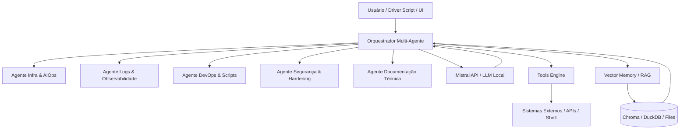
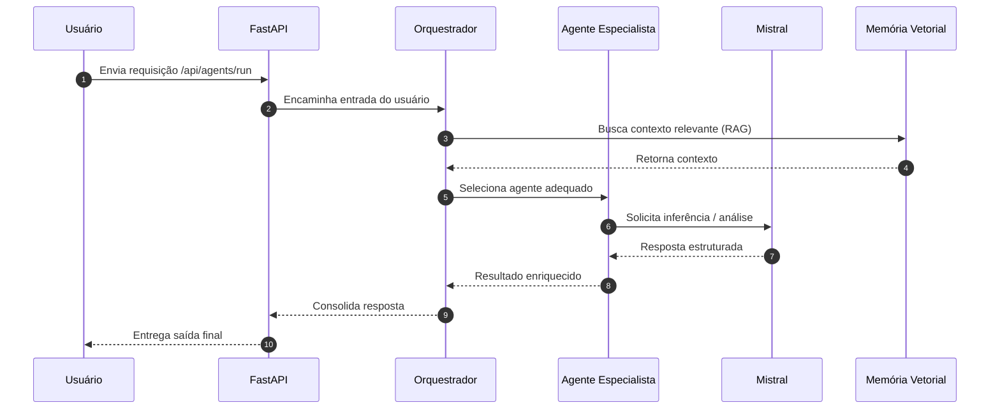
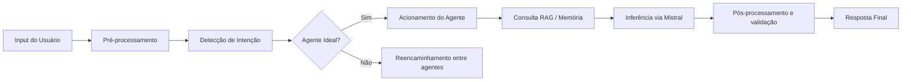
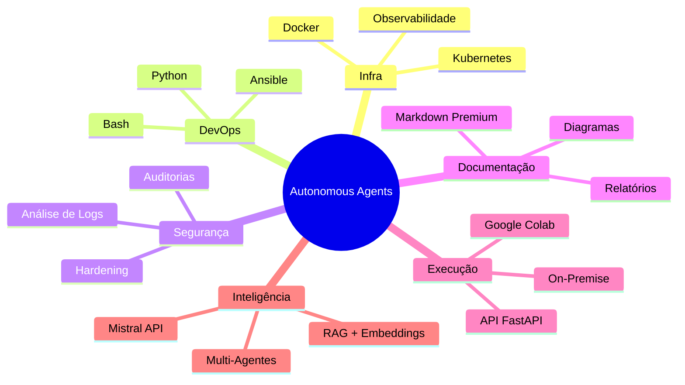
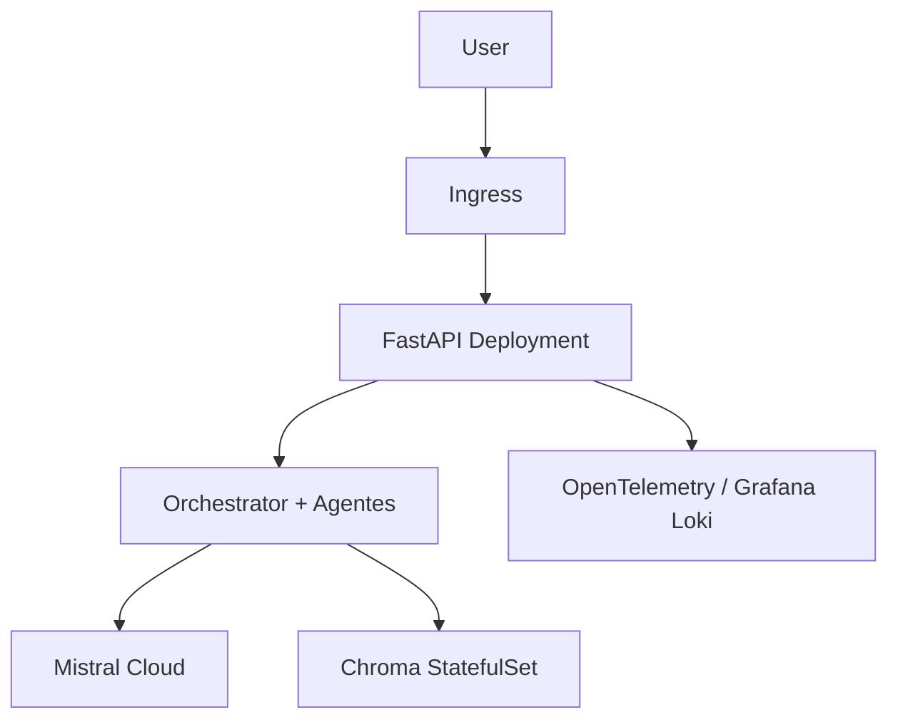

# Autonomous Expert Agents — Mistral + Google Colab
### Cortex Hub

## 🔎 Visão Geral

Este repositório consolida uma arquitetura de **agentes autônomos especialistas** construída sobre:

* Modelos Mistral (API e modelos open-weight)
* Orquestração multi-agente em Python
* Memória vetorial persistente (RAG / embeddings)
* Execução em Google Colab com GPU
* Deploy On-Premise via FastAPI + Docker + Nginx (pronto para K8s)

O foco é demonstrar nível sênior de engenharia em IA aplicada a operações (AIOps), com:

* Design modular, idempotente e escalável
* Observabilidade e logging estruturado
* Integração natural com stacks modernos (infra, monitoração, automação)
* Capacidade de evoluir para ambientes enterprise (on-prem / híbrido / cloud)

---

## 🧠 Arquitetura Multi-Agente



---

## 🚀 Getting Started

### 1. Clonar o repositório

```
git clone https://github.com/<org>/<repo>.git
cd <repo>
```

### 2. Instalar dependências

```
pip install -r requirements.txt
```

### 3. Configurar API Key

```
export MISTRAL_API_KEY="sua-chave-mistral"
```

### 4. Executar o orquestrador

```
python main.py
```

---

## 🧩 Binding com Mistral

```python
from mistralai import MistralClient
import os

client = MistralClient(api_key=os.environ["MISTRAL_API_KEY"])

response = client.chat.complete(
    model="mistral-large-latest",
    messages=[
        {"role": "user", "content": "Analise este log de aplicação e proponha um diagnóstico."}
    ]
)

print(response.choices[0].message.content)
```

---

## 📁 Estrutura do Projeto

```
/
├── agents/
│   ├── infra_agent.py
│   ├── devops_agent.py
│   ├── security_agent.py
│   ├── logs_agent.py
│   ├── doc_agent.py
│   └── orchestrator.py
│
├── tools/
│   ├── shell_tools.py
│   ├── file_tools.py
│   ├── http_tools.py
│   └── observability_tools.py
│
├── memory/
│   ├── embeddings.py
│   ├── vector_store.py
│   └── documents/
│
├── notebooks/
│   ├── quickstart_colab.ipynb
│   └── enterprise_demo.ipynb
│
├── api/
│   ├── app.py
│   └── routers/
│       └── agents.py
│
├── docker/
│   ├── Dockerfile.api
│   ├── nginx.conf
│   └── docker-compose.yml
│
├── .github/
│   └── workflows/
│       └── ci.yml
│
├── main.py
├── requirements.txt
└── README.md
```

---

## 🔧 CI/CD — GitHub Actions

Pipeline CI em `.github/workflows/ci.yml` com lint, tests e smoke build.

```yaml
ame: CI

on:
  push:
    branches: [ main, master ]
  pull_request:
    branches: [ main, master ]

jobs:
  lint:
    name: Linter (Python)
    runs-on: ubuntu-latest
    steps:
      - uses: actions/checkout@v4
      - uses: actions/setup-python@v5
        with:
          python-version: "3.11"
      - run: pip install -r requirements.txt ruff
      - run: ruff check .

  tests:
    name: Testes Automatizados
    runs-on: ubuntu-latest
    needs: lint
    steps:
      - uses: actions/checkout@v4
      - uses: actions/setup-python@v5
        with:
          python-version: "3.11"
      - run: pip install -r requirements.txt pytest
      - run: pytest -q || echo "Nenhum teste encontrado"

  build:
    name: Build / Smoke Test
    runs-on: ubuntu-latest
    needs: tests
    steps:
      - uses: actions/checkout@v4
      - uses: actions/setup-python@v5
        with:
          python-version: "3.11"
      - run: pip install -r requirements.txt
      - run: |
          python - << 'EOF'
          try:
              import main
              print("Main importado com sucesso.")
          except Exception as e:
              print(e)
              raise
          EOF
```

---

## 🧱 Guia de Deploy On-Premise (Docker + FastAPI + Nginx)

### Dockerfile da API

```dockerfile
FROM python:3.11-slim
WORKDIR /app
COPY requirements.txt .
RUN pip install --no-cache-dir -r requirements.txt
COPY . .
EXPOSE 8000
CMD ["uvicorn", "api.app:app", "--host", "0.0.0.0", "--port", "8000"]
```

### Nginx Reverse Proxy

```nginx
events {}
http {
    server {
        listen 80;
        server_name _;
        location / { proxy_pass http://api:8000; }
    }
}
```

### docker-compose

```yaml
version: "3.9"
services:
  api:
    build:
      context: ..
      dockerfile: docker/Dockerfile.api
    env_file:
      - ../.env
    ports:
      - "8000:8000"

  nginx:
    image: nginx:stable
    volumes:
      - ./nginx.conf:/etc/nginx/nginx.conf:ro
    depends_on:
      - api
    ports:
      - "80:80"
```

## 🧭 Fluxo Operacional dos Agentes



---

## 🧩 Pipeline Interno de Raciocínio



---

## 🧬 Mapa Mental da Arquitetura



---

## ⚙️ Guia de Extensão (Como Criar Novos Agentes)

### 1. Criar classe do agente

```python
class NetworkAgent(BaseAgent):
    name = "network_agent"
    role = "Especialista em redes"

    def run(self, input_text):
        return self.llm(f"Diagnostique esse contexto de rede: {input_text}")
```

### 2. Registrar no orquestrador

```python
orchestrator.register_agent(NetworkAgent())
```

### 3. Adicionar ferramentas (opcional)

```python
@tool("ping")
def ping(host):
    return subprocess.getoutput(f"ping -c 2 {host}")
```

---

## 📡 Diagramas de Deploy em Kubernetes



---

## 🧱 Blocos Premium para Observabilidade

> **Resumo:**
> Sistema avançado de agentes autônomos corporativos, com execução híbrida (cloud + on-premise), processamento vetorial, observabilidade integrada, alto nível de modularidade e orquestração inteligente baseada em intenção.

> **Pontos-Chave:**
>
> * Multi-agentes escaláveis
> * Mistral + RAG
> * Execução acelerada em Colab
> * Pronto para ambientes enterprise

---

MIT License.

